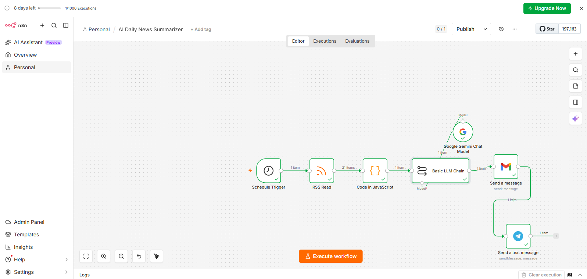
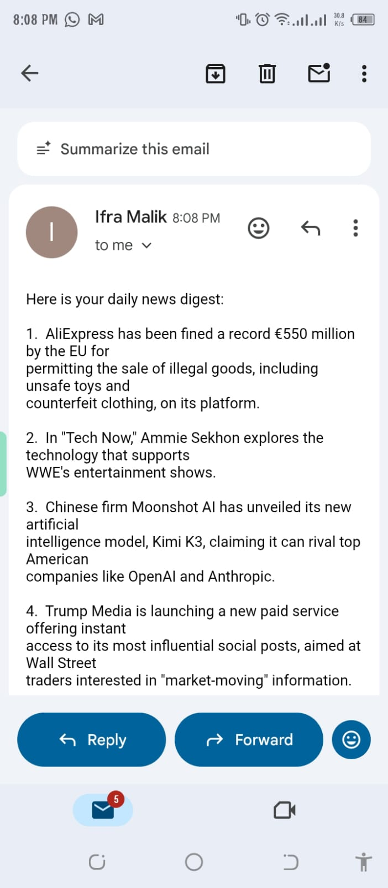
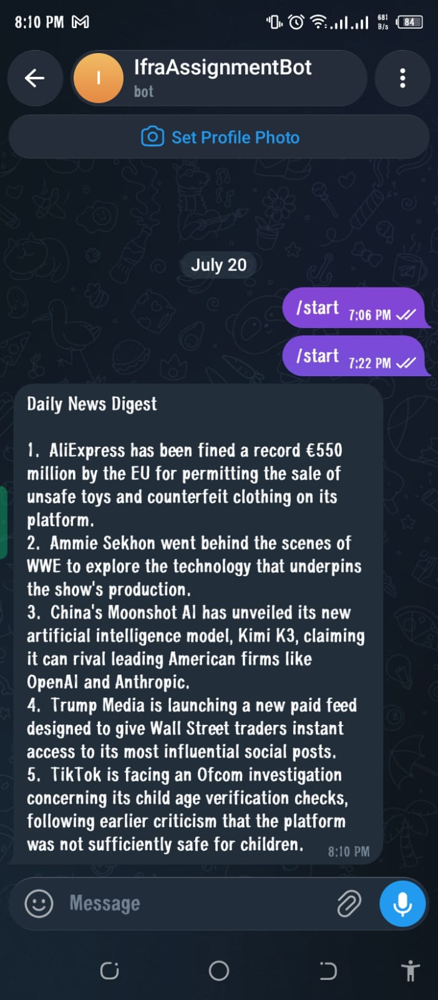

# 🚀 AI Daily News Summarizer using n8n, Google Gemini, Gmail & Telegram

An AI-powered automation workflow built with **n8n** that fetches the latest technology news from the **BBC RSS Feed**, summarizes it using **Google Gemini AI**, and automatically delivers a daily news digest via **Gmail** and **Telegram**.

This project demonstrates practical workflow automation by integrating AI, RSS feeds, email services, and messaging platforms into a single automated pipeline.

---

## 📖 Overview

Reading multiple news articles every day can be time-consuming. This workflow automates the entire process by:

- Fetching the latest BBC Technology news
- Selecting the latest 5 articles
- Summarizing them using Google Gemini AI
- Sending a concise daily digest via Gmail
- Delivering the same summary instantly through Telegram

The workflow runs automatically every day without manual intervention.

---

## ✨ Features

- ⏰ Daily scheduled automation using n8n
- 📰 Fetches the latest BBC Technology news
- 🤖 AI-powered news summarization using Google Gemini 2.5 Flash
- 📧 Automatically sends summaries via Gmail
- 📱 Sends instant Telegram notifications
- ⚡ Sorts articles by publication date
- 🧠 Uses JavaScript for data processing
- 🔄 Fully automated end-to-end workflow

---

# 🏗 Workflow Architecture

```text
Schedule Trigger
        │
        ▼
RSS Feed (BBC Technology)
        │
        ▼
JavaScript Code
(Sort & Combine Latest 5 Articles)
        │
        ▼
Google Gemini AI
(Generate Summary)
        │
        ├────────────► Gmail
        │
        └────────────► Telegram
```

---

# 🛠 Tech Stack

- n8n
- Google Gemini 2.5 Flash
- BBC RSS Feed
- Gmail API
- Telegram Bot API
- JavaScript

---

# ⚙️ Workflow Explanation

## 1. Schedule Trigger

The workflow starts automatically every day at **8:00 PM**.

---

## 2. RSS Feed

Reads the latest technology news from:

```
https://feeds.bbci.co.uk/news/technology/rss.xml
```

Each article includes:

- Title
- Publication Date
- Content Snippet
- Article Link

---

## 3. JavaScript Processing

The Code node:

- Sorts articles by publication date
- Picks the latest five articles
- Combines them into a single prompt for Gemini AI

```javascript
const news = items
.sort((a, b) => new Date(b.json.isoDate) - new Date(a.json.isoDate))
.slice(0, 5)
.map((item, index) => {
  return `${index + 1}. ${item.json.title}
${item.json.contentSnippet}`;
})
.join("\n\n");

return [
  {
    json: {
      news
    }
  }
];
```

---

## 4. Google Gemini AI

Google Gemini 2.5 Flash summarizes all collected articles into a clean daily digest.

Prompt used:

```text
Create a daily news digest from these latest BBC news articles.

{{$json.news}}

Rules:
- Do not use Markdown.
- Do not use asterisks (*).
- Do not use bullet symbols.
- Return plain text only.
- Use numbered points.
```

---

## 5. Gmail

The generated summary is automatically emailed.

Subject:

```
Daily AI News Summary
```

---

## 6. Telegram

The same AI-generated summary is sent to Telegram using a Telegram Bot.

---

# 📂 Project Structure

```
AI-Daily-News-Summarizer/
│
├── AI Daily News Summarizer(1)
├── README.md
└── screenshots/
    ├── rss.png
    ├── gmail.jpeg
    └── telegram.jpeg
```

---

# 🚀 Getting Started

## Prerequisites

- n8n
- Google Gemini API Key
- Gmail Account
- Telegram Bot Token

---

## Installation

Clone the repository:

```bash
git clone https://github.com/yourusername/AI-Daily-News-Summarizer.git
```

Open n8n and import:

```
workflow.json
```

Configure:

- Google Gemini credentials
- Gmail OAuth
- Telegram Bot Token
- Telegram Chat ID

Activate the workflow.

---

# 📸 Screenshots


<p align="center">
  
</p>

<p align="center">
  
</p>
<p align="center">
  
</p>


---

# 🎯 Learning Outcomes

This project helped me learn:

- Workflow automation using n8n
- AI integration with Google Gemini
- RSS Feed processing
- Gmail automation
- Telegram Bot integration
- JavaScript data transformation
- Building real-world no-code/low-code AI workflows

---

# 🔮 Future Improvements

- Multiple news sources
- Personalized news categories
- News sentiment analysis
- AI-generated voice summaries
- Database integration
- Web dashboard
- Slack and Discord notifications

---

# 👩‍💻 Author

**Ifra Malik**

GitHub: https://github.com/ifra489

LinkedIn: https://www.linkedin.com/in/ifra-malik-09236836a

---

## ⭐ If you found this project useful, consider giving it a star!v


