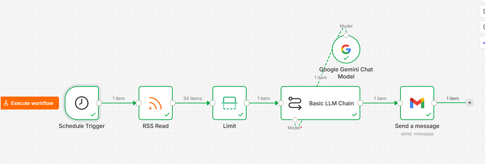
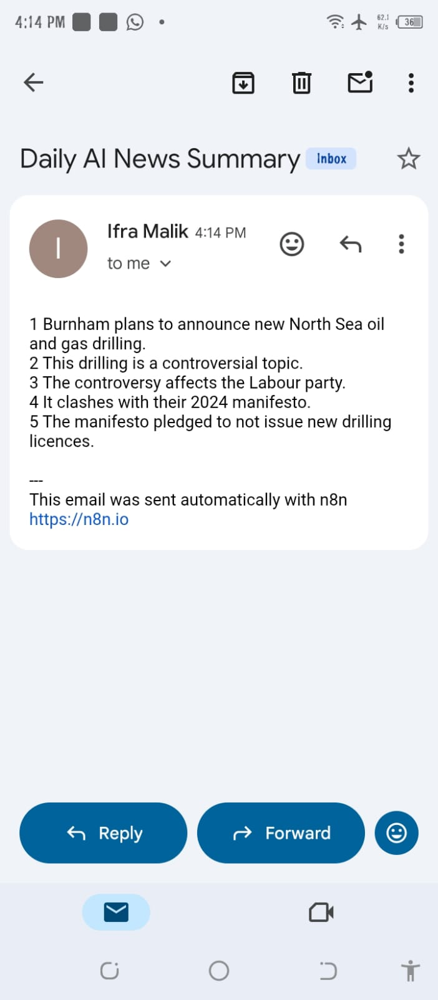

# AI Daily News Summarizer

An AI-powered automation workflow built with n8n that automatically fetches the latest BBC News through an RSS feed, summarizes it using Google Gemini AI, and sends the summary via Gmail.

## Workflow

Schedule Trigger
↓
RSS Read (BBC News)
↓
Limit
↓
Google Gemini AI (Basic LLM Chain)
↓
Gmail (Send Email)

## Features

- Fetches the latest BBC News automatically
- Summarizes news using Google Gemini AI
- Sends daily email summaries
- Fully automated using n8n

## Technologies Used

- n8n
- Google Gemini AI
- Gmail
- RSS Feed (BBC News)

## Use Cases

- Daily news digest
- AI-powered news summarization
- Email automation
- Productivity automation

##  Screenshot

  

  

## Workflow JSON

The exported workflow is available in `Ai Daily News Summarizer.json`.
